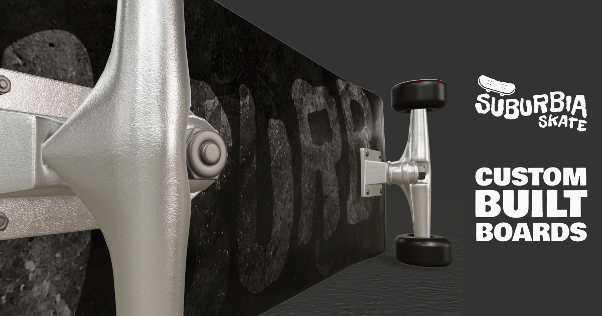
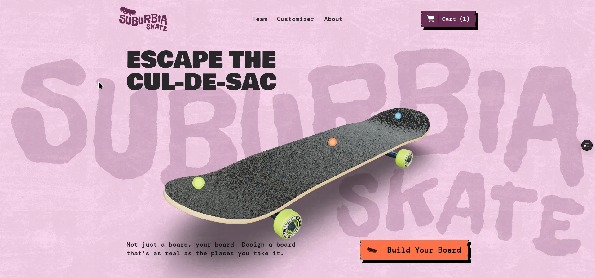
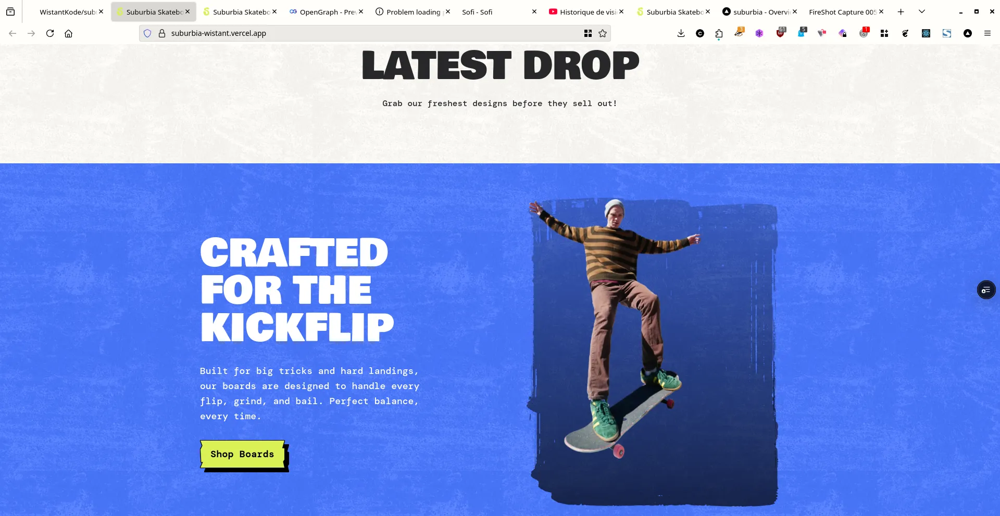
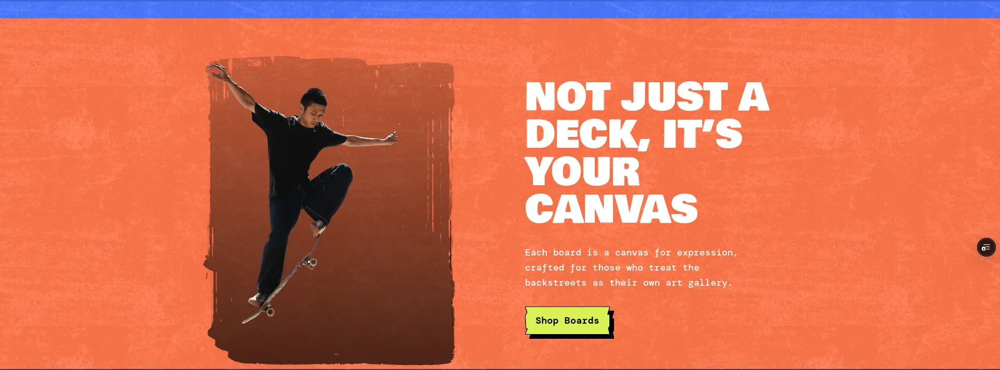
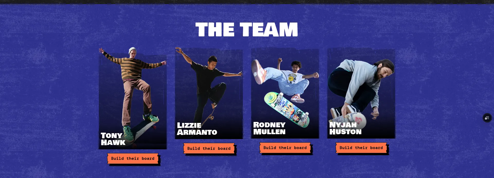
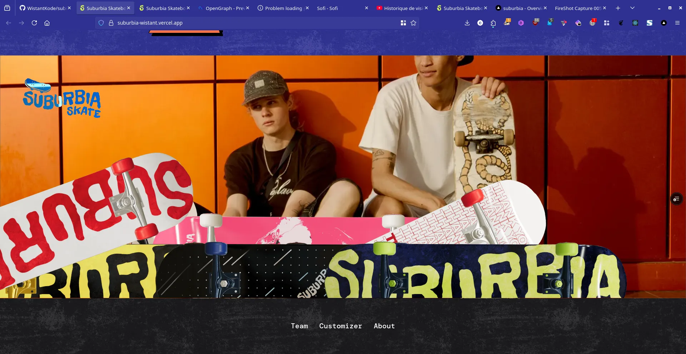

<div align="center">
  
  
  <h1>Suburbia Skateboards</h1>
  
  <p>
    <strong>A high-performance, interactive 3D e-commerce storefront.</strong><br>
    Built with Next.js, WebGL, and static local data for unparalleled speed and autonomy.
  </p>

  <div>
    
    
    
    
    
    
  </div>
</div>

<br />

## Overview

Suburbia is an experimental e-commerce frontend demonstrating the integration of real-time 3D rendering within a modern web application architecture. Using React Three Fiber and Next.js App Router, it provides a seamless shopping experience where users can interact with products in 3D space, heavily optimized through static site generation (SSG).

The repository has been recently refactored to operate 100% autonomously, migrating away from remote headless CMS dependencies in favor of a strictly typed, version-controlled local data layer.

## Interface Showcase

The application features advanced scroll-linked animations, parallax effects, and a custom 3D configurator.

<div align="center">
  
  <br /><em>Hero section featuring GSAP animations and dynamic text composition.</em><br /><br />
  
  
  <br /><em>Interactive product grids highlighting the latest deck concepts.</em><br /><br />
  
  
  <br /><em>Parallax scrolling interfaces leading to the 3D board customizer.</em><br /><br />
  
  
  <br /><em>The Team roster showcasing distinct masking and overlay effects.</em><br /><br />
  
  
  <br /><em>Clean, responsive application footprint.</em>
</div>

## Technical Architecture

- **Rendering Engine:** WebGL via `three` and `@react-three/fiber` for real-time 3D board customization.
- **Data Layer:** Fully autonomous and decoupled. Dynamic content (slices, product data, customizer options) is managed statically via TypeScript interfaces in `src/data/`.
- **Styling:** Utility-first styling with Tailwind CSS, orchestrated with `clsx` for dynamic responsive states.
- **Animations:** High-performance DOM animations powered by `gsap`.

## Local Development

The project utilizes [Bun](https://bun.sh/) as its primary package manager and runtime for optimal execution speeds.

1. **Install Dependencies:**

   ```bash
   bun install
   ```

2. **Start the Development Server:**

   ```bash
   bun run dev
   ```

3. **Production Build:**

   ```bash
   bun run build
   ```

The application will be running locally at `http://localhost:3000`.
